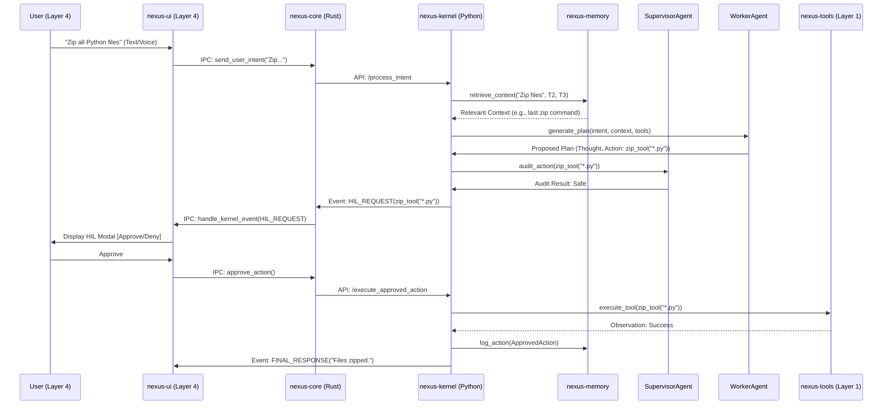

# Low-Level Architecture (LLA): Nexus - The Hybrid AIOS

**Author:** Manus AI
**Version:** 1.0
**Date:** Jan 01, 2026

## 1. Introduction

This Low-Level Architecture (LLA) document translates the High-Level Architecture (HLA) into a detailed, module-by-module specification. It defines the internal structure, component interfaces, and data flow necessary for the implementation of **Nexus**.

## 2. Module Breakdown and Dependencies

The Nexus system is logically divided into four primary modules, each with a distinct responsibility.

| Module Name | Technology Stack | Primary Responsibility | Key Dependencies |
| :--- | :--- | :--- | :--- |
| **nexus-ui** | Tauri (Rust/React) | User Interface, HIL Modal, Voice I/O | `nexus-core` (via IPC) |
| **nexus-core** | Rust (Tauri Backend) | System Orchestration, IPC Handling, Voice Bridge | `nexus-kernel` (via Local API) |
| **nexus-kernel** | Python (FastAPI, CrewAI) | All Agentic Logic (Scheduler, Supervisor, Worker) | `nexus-memory`, `nexus-tools`, Ollama API |
| **nexus-memory** | Python (LanceDB) | Tiered Memory Management (RAG, History) | LanceDB Library, Ollama API (for embeddings) |

### 2.1. Module: `nexus-ui` (Tauri Frontend)
*   **Purpose:** Provide the user-facing application and handle all input/output.
*   **Key Classes/Components:**
    *   `CommandPalette.tsx`: Handles global hotkey and text input.
    *   `HILModal.tsx`: Displays proposed system actions for user approval.
    *   `VoiceInput.ts`: Manages wake word detection and STT/TTS communication.

### 2.2. Module: `nexus-core` (Tauri Backend)
*   **Purpose:** Bridge the UI to the Python kernel and manage system-level tasks (e.g., Ollama service lifecycle).
*   **Key Functions:**
    *   `start_kernel()`: Initializes the Python `nexus-kernel` process.
    *   `send_user_intent(intent: str)`: Sends user input to the `nexus-kernel` API.
    *   `handle_kernel_event(event: KernelEvent)`: Receives real-time updates (Thought, Action, HIL Request) from the kernel.

## 3. Module: `nexus-kernel` (The Brain)

This module contains the core Level 3 intelligence and is the most complex.

### 3.1. Sub-Module: `orchestrator`
*   **Purpose:** Manages the overall agentic loop and state.
*   **Key Class:** `AgentOrchestrator`
    *   `process_intent(intent: str)`: Main entry point.
    *   `run_agent_loop()`: Executes the Thought-Action-Observation cycle.

### 3.2. Sub-Module: `scheduler` (Context Scheduler)
*   **Purpose:** Intent routing and prompt optimization.
*   **Key Class:** `ContextScheduler`
    *   `route_intent(intent: str)`: Determines the required LLM and context tiers.
    *   **Logic:** Uses a small LLM to classify intent into categories (e.g., `[File_Op, Code_Gen, RAG_Query]`) and assigns the appropriate Worker LLM based on the classification.
    *   `assemble_prompt(intent: str, context: List[str], tools: List[Tool])`: Generates the final, optimized system prompt for the Worker Agent.

### 3.3. Sub-Module: `supervisor` (Agentic Supervisor)
*   **Purpose:** Safety and self-correction.
*   **Key Class:** `SupervisorAgent`
    *   `audit_action(action: ToolCall)`: Checks proposed actions against safety rules.
    *   **Logic:** Compares the proposed command string against a regex-based safety blacklist (e.g., `rm -rf /`, `Format-Volume`) and a semantic check (using a small LLM) to ensure the action aligns with the original intent.
    *   `debug_failure(error_log: str, last_plan: str)`: Generates corrective instructions for the Worker Agent.

### 3.4. Sub-Module: `worker` (Worker Agent)
*   **Purpose:** Generates plans and executes tool calls.
*   **Key Class:** `WorkerAgent`
    *   `generate_plan(prompt: str)`: Outputs a structured plan (e.g., JSON) using a powerful LLM.
    *   `execute_tool(tool_call: ToolCall)`: Calls the `nexus-tools` module.

## 4. Module: `nexus-memory` (The Memory)

This module manages all interactions with the LanceDB vector store.

### 4.1. Key Class: `MemoryManager`
*   **Purpose:** Abstract the tiered memory logic from the kernel.
*   **Key Methods:**
    *   `retrieve_context(query: str, tier: MemoryTier)`: Performs vector search and returns relevant text chunks.
    *   **Logic:** For Tier 2 (Short-term), retrieval is a hybrid of vector search and time-based filtering (e.g., prioritize approved actions from the last 24 hours).
    *   `log_action(action: ApprovedAction)`: Writes approved actions to Tier 2 (Short-term) memory.
    *   `index_document(path: str)`: Adds a new document to Tier 3 (Long-term) memory.

### 4.2. Data Structures (LanceDB Schema)
*   **Tier 2 (Short-term):** `id`, `vector`, `timestamp`, `event_type`, `summary_text`, `full_command`.
*   **Tier 3 (Long-term):** `id`, `vector`, `file_path`, `chunk_text`, `last_modified`.

## 5. Key Workflow: User Intent to System Execution

The following sequence diagram illustrates the low-level flow for a system-modifying request (e.g., "Find all Python files and zip them").

## 6. Internal API Specifications

The primary internal API is the **REST API** exposed by the `nexus-kernel` module (using FastAPI) to the `nexus-core` module.

| Endpoint | Method | Description | Request Body | Response Body |
| :--- | :--- | :--- | :--- | :--- |
| `/intent` | POST | Main entry point for user requests. | `{ "intent": str }` | `{ "status": str, "session_id": str }` |
| `/execute` | POST | Executes a pre-approved action. | `{ "session_id": str, "action_id": str }` | `{ "status": str, "observation": str }` |
| `/memory/index` | POST | Indexes a new document into Tier 3. | `{ "path": str }` | `{ "status": str }` |
| `/status` | GET | Returns the status of the kernel and Ollama service. | None | `{ "kernel_status": str, "ollama_status": str }` |

---
*End of Document*
